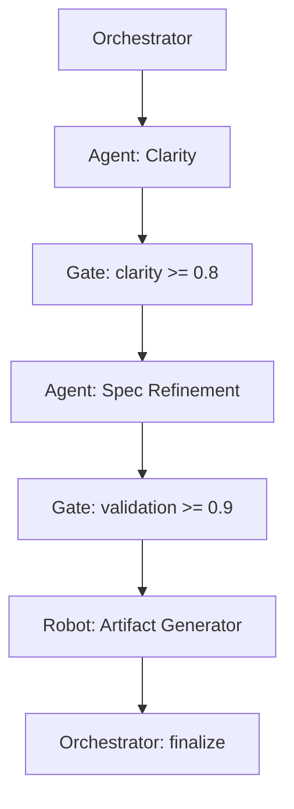

# PDD Automation Architecture

Diese Architektur beschreibt, **wie** Prompt‑Driven Development (PDD) automatisiert werden kann – ohne eine konkrete technische Implementierung vorzugeben.  
Sie ist ein **Meta‑Modell**, kein Tool.  
Sie definiert Rollen, Datenflüsse und Prinzipien, die unabhängig von Technologien, LLM‑Versionen oder Automationsplattformen gültig bleiben.

---

# 1. Zweck & Scope

Die PDD Automation Architecture hat drei Ziele:

1. **Standardisierung**  
   Ein gemeinsames Modell, wie PDD‑Prozesse automatisiert, überwacht und bewertet werden können.

2. **Verantwortungssicherung**  
   Automatisierung darf Verantwortung nicht verwischen.  
   Die Architektur stellt sicher, dass menschliche Entscheidungen sichtbar bleiben.

3. **Tool‑Agnostik**  
   Die Architektur beschreibt *Strukturen*, nicht Implementierungen.  
   Sie kann mit GitHub Actions, Airflow, Temporal, Makefiles, Shell‑Skripten oder manuellen Workflows umgesetzt werden.

---

# 2. Rollenmodell

Die Architektur unterscheidet vier Rollen.  
Sie sind **Funktionen**, keine technischen Komponenten.

---

## 2.1 Orchestrator

Der Orchestrator ist die zentrale Steuerinstanz.

**Aufgaben:**

- führt die Pipeline‑Schritte in definierter Reihenfolge aus  
- übergibt Tasks an Agents  
- sammelt Ergebnisse  
- entscheidet anhand von Gates über Fortsetzung oder Eskalation  
- erzeugt und aktualisiert den Task Envelope  

**Wichtig:**  
Der Orchestrator trifft **keine fachlichen Entscheidungen**.

---

## 2.2 Agents

Agents sind spezialisierte KI‑ oder Automationsmodule, die **Teilaufgaben** übernehmen.

Beispiele:

- „Clarity Agent“ (prüft Klarheit)  
- „Decomposition Agent“ (zerlegt komplexe Aufgaben)  
- „Spec Agent“ (hilft bei Spezifikationen)  
- „Review Agent“ (prüft Ergebnisse gegen Kriterien)  

Agents sind **Werkzeuge**, keine Entscheider.

---

## 2.3 Gates

Gates sind **Qualitäts‑ und Verantwortungsprüfungen**, die zwischen Pipeline‑Schritten liegen.

Es gibt zwei Arten:

### **Deterministische Gates (empfohlen, primär)**

- regelbasiert  
- reproduzierbar  
- transparent  
- z. B. „Sind alle Annahmen explizit?“  
- z. B. „Sind alle Kriterien testbar?“  

### **LLM‑Judge Gates (ergänzend, sekundär)**

- KI‑basierte Bewertung  
- nur dort, wo Regeln nicht ausreichen  
- niemals alleinige Entscheidungsinstanz  

**Prinzip:**  
> Deterministische Gates zuerst.  
> LLM‑Judges nur ergänzend.

---

## 2.4 Robots

Robots sind **mechanische Automationsschritte**, die keine KI benötigen.

Beispiele:

- Hashing von Prompts und Outputs  
- Generieren von Artefakt‑Dateien  
- Validieren von YAML/JSON  
- Versionieren von Ergebnissen  
- Ausführen von Linting‑Regeln  

Robots sind „dumb but safe“.

---

# 3. Datenfluss

Der Datenfluss basiert auf drei zentralen Artefakten:

---

## 3.1 Task Envelope

Das kanonische Datenmodell eines PDD‑Tasks.

Enthält u. a.:

- run_id  
- issue_id  
- task_id  
- risk_level  
- prompt_hash  
- output_hash  
- context  
- inputs  
- outputs  
- evidence  
- artifacts  
- escalation  

Der Task Envelope ist das **Single Source of Truth**.

---

## 3.2 Pipeline Config

Eine deklarative Konfiguration der Pipeline:

- Schritte  
- Gates  
- Metriken  
- Eskalationspfade  
- Defaults  

Sie definiert **Normen**, keine Abläufe.

---

## 3.3 Artefakte

Ergebnisse, die aus dem Prozess hervorgehen:

- Spezifikationen  
- Kriterienlisten  
- ADRs  
- Diagramme  
- Modelle  
- Dokumentation  

Artefakte sind **dauerhaft**, Prompts sind **temporär**.

---

# 4. Prinzipien

Diese Architektur folgt fünf Grundprinzipien.

---

## 4.1 Meta, nicht Tool

Die Architektur beschreibt **Konzepte**, keine Implementierungen.

- kein Framework  
- keine Library  
- keine Abhängigkeit  
- keine Runtime  

Sie ist ein **Referenzmodell**.

---

## 4.2 Deterministische Gates first

Regeln > KI.

- deterministische Gates sind reproduzierbar  
- sie verhindern Halluzinationen  
- sie sichern Verantwortung  

LLM‑Judges sind nur Ergänzung.

---

## 4.3 Verantwortung bleibt beim Menschen

Automatisierung darf Verantwortung nicht verschleiern.

- Agents schlagen vor  
- Gates prüfen  
- Orchestrator steuert  
- **Mensch entscheidet**

---

## 4.4 Transparenz über den gesamten Prozess

Jeder Schritt muss nachvollziehbar sein:

- Was wurde entschieden?  
- Warum?  
- Auf Basis welcher Kriterien?  
- Welche Annahmen galten?  

Der Task Envelope stellt diese Transparenz sicher.

---

## 4.5 Reproduzierbarkeit

Ein PDD‑Prozess muss reproduzierbar sein:

- gleicher Prompt → gleiches Ergebnis (innerhalb LLM‑Toleranz)  
- gleiche Pipeline → gleiche Entscheidungen  
- gleiche Gates → gleiche Bewertung  

Reproduzierbarkeit ist wichtiger als Geschwindigkeit.

---

# 5. Zusammenspiel der Komponenten

Ein typischer Ablauf:

1. Orchestrator erzeugt neuen Task Envelope  
2. Orchestrator lädt Pipeline Config  
3. Orchestrator startet Schritt 1  
4. Agent führt Aufgabe aus  
5. Gate prüft Ergebnis  
6. Bei Erfolg → nächster Schritt  
7. Bei Fehler → Eskalation  
8. Robots erzeugen Artefakte  
9. Orchestrator schließt Task ab  

Der Prozess ist **deterministisch**, außer an Stellen, an denen bewusst KI eingesetzt wird.

---

# 6. Beispielablauf (konzeptionell)

---

# 7. Grenzen & Nicht‑Ziele

Diese Architektur ist **kein**:

- Workflow‑Engine  
- KI‑Framework  
- Prompt‑Library  
- Automationssystem  
- Tooling‑Standard  

Sie ist ein **Meta‑Standard**, der beschreibt:

> Wie verantwortungsvolle KI‑Automatisierung aussehen sollte.

---

# Abschluss

Die PDD Automation Architecture ist ein **zeitstabiles Fundament** für jede Form von KI‑gestützter Arbeit.  
Sie schützt Verantwortung, erhöht Qualität und schafft Klarheit – unabhängig davon, wie sich KI‑Technologie weiterentwickelt.

